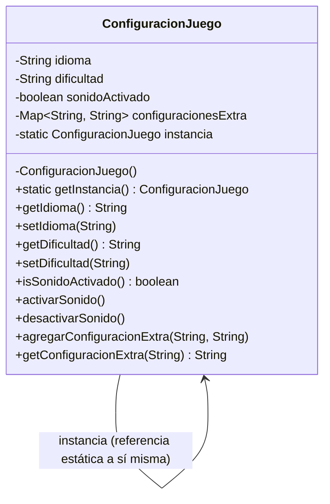
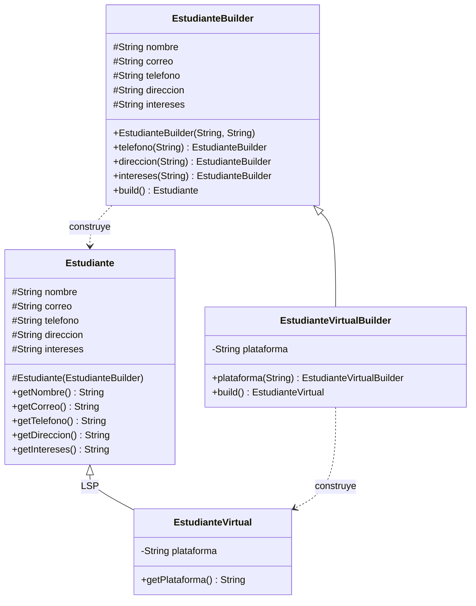

# Diagramas UML — Patrones de diseño

## 2. Configuración de un juego en línea — Singleton



---

## 3. Registro de estudiantes — Builder



---

## 4. Biblioteca digital y libros personalizados — Prototype

```mermaid
classDiagram
    class LibroPrototype {
        <<interface>>
        +clone() LibroPrototype
    }
    class Libro {
        -String titulo
        -String autor
        -List~String~ anotaciones
        -List~String~ marcadores
        -String resumen
        +clone() Libro
        +agregarAnotacion(String)
        +agregarMarcador(String)
        +setResumen(String)
    }
    class PersonalizadorLibro {
        <<interface>>
        +personalizar(Libro)
    }
    class PersonalizadorAnotaciones {
        -String anotacion
        +personalizar(Libro)
    }
    LibroPrototype <|.. Libro
    PersonalizadorLibro <|.. PersonalizadorAnotaciones
    PersonalizadorAnotaciones ..> Libro : personaliza (DIP: depende de la abstracción)
```

---

## 5. Sistema de vehículos compartidos — Builder + Prototype

```mermaid
classDiagram
    class Vehiculo {
        <<abstract>>
        #String tipo
        #String placa
        #String color
        #int capacidad
        #List~String~ accesorios
        +clonar() Vehiculo
    }
    class Carro
    class Moto
    class Bicicleta
    class ClonableVehiculo {
        <<interface>>
        +clonar() Vehiculo
    }
    class Construible~T~ {
        <<interface>>
        +build() T
    }
    class VehiculoBuilder {
        #String tipo
        #String placa
        #String color
        #int capacidad
        #List~String~ accesorios
        +color(String) VehiculoBuilder
        +capacidad(int) VehiculoBuilder
        +accesorio(String) VehiculoBuilder
        +build() Vehiculo
    }
    Vehiculo <|-- Carro
    Vehiculo <|-- Moto
    Vehiculo <|-- Bicicleta
    ClonableVehiculo <|.. Vehiculo
    Construible <|.. VehiculoBuilder
    VehiculoBuilder ..> Vehiculo : construye (ISP: separado de la clonación)
```
